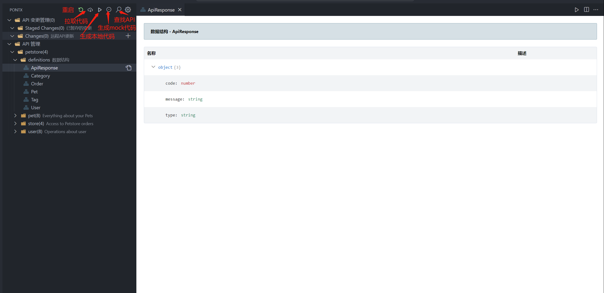

# CONTRIBUTING

## GET START

```sh
git clone git@github.com:pontjs/pontx.git

cd pontx

# suggested use yarn instead of npm to install
npm run inst

lerna bootstrap

# 初始化环境

# 启动项目
npm start

# 启动 pontx-ui
npm run ui
```

## release

```sh
lerna bootstrap
# 构建
npm run build
# 发布 npm 包
npm run release:npm
# 可选，同步到不同公司内部仓库。
npm run sync:npm
# 发布 vscode 插件市场
npm run release:vscode
```

## Debug with VSCode

Debug pontx-cli by select "Debug Pontx CLI" in VSCode Debug Panel.
Debug vscode-pontx by select "Debug Extension" in VSCode Debug Panel.

## Examples

```shell
cd examples/hooks-app

yarn
npm install
pnpm install
```

使用 vscode-pontx 插件，生成代码，当看到 src 目录下，生成了 services 文件夹即为成功。
​

## Code Style

## 为什么做 Pontx 升级

- 1、原 Pont Spec 设计不合理，Pontx 拥抱行业标准，在 Spec 设计上拥抱 JSON Schema 和 OAS，以降低 parser 和其它插件的开发成本。
- 2、Pont 在不同功能的定制化需求多样，社区需要一个插件化的 Pont，以低成本，标准化的方式，开发和贡献可贡献的 Pont 插件库。
- 3、升级 Pont 在部分技术细节上的设计。详情见各插件和模块说明。

## 设计理念

拥抱标准、插件化。内核能力基于半结构数据管理框架支持。

## 规划

## pontx architecture

### kernel

- pontx-cli

  pontx 命令行，等同于 pontx 入口，执行时主要经过以下步骤：

  - 寻找 pontx-config.json 文件，生成 pontManager 实例。
  - 根据 api-lock.json 本地文件或根据 remote 地址，读取数据，并生成代码。

- pontx-spec
  描述 Pont 标准数据源的类型，提供 Pont 标准数据源的常用数据处理方法。
  新版 Pont 标准数据源做了升级，拥抱 JSONSchema 标准。

- pontx-spec-diff

  主要提供对比差异，比如远程数据和本地暂存数据的对比、BaseClass 的对比、API 的对比等等

- oas-spec-ts

  全名 openApiSpecification-spec-typescript,主要提供 openapi 的标准与规范。

  在项目中主要提供 interface，供给 parse 插件使用。

- generate

  根据符合 PontSpec 规范的数据，提供代码解析以及生成 JavaScript 和 TypeScript 代码的功能。

  目前在 pontx-react-hooks-generate-plugin 插件内引用了其中的 typescript 代码生成模块。

- pontx-manager
  提供 pontx 管理类，主要提供如下能力。

  - 加载 pontx 配置，构建 pontx 管理类
  - 不同生命周期插件加载和执行

- pontx-ui

  pontx 文档界面，采用 React+webpack 作为技术栈，持续开发中...

- vscode-pontx

  集成了 pontx-manager、pontx-spec 模块，提供拉取代码、生成本地代码、mock 代码等功能，更有 UI 界面展示数据结构（vscode-pontx/media）。

  

以 pontx-spec 元数据渲染的 API 工具组件库。 包括：

- API 搜索
- API 设计
- 目录
- API 文档
- API 调试
- API mocks 编辑。

以上组件在 pontx-platform 场景中，用于构建 API 管理平台和 API 门户。
在 IDE 场景中，通过 webview 的方式用于 IDE 相关 API 功能的渲染。

### plugins

pont 在不同生命周期提供的能力，目前都已进行插件化改造。其中常用插件，也将在 pont 代码库中维护，以把控质量，并为社区化开发提供样板。
插件类别如下：

- fetch 元数据请求插件

  内置插件：

  - pontx-meta-fetch-plugin (done) 通过接口请求元数据

- parser 元数据解析转换插件

  - pontx-oas2-parser-plugin (done) Swagger2 转换为 pontx-spec 的插件

- generate

  - pontx-generate-core (done)
    提供 SDK 生成的基本方法，提供调用示例的 snippet。

  - pontx-react-hooks-generate-plugin (done)
    生成前端 SDK。包含 React Hooks 的调用方法（use-swr）。

- mocks (WiP)
  提供 mocks 服务。

- report (WIP)
  记录变更
